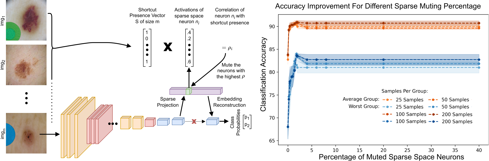

# Weakly Supervised Shortcut Learning Mitigation Using Sparse AutoEncoders
Code and data for the paper "Weakly Supervised Shortcut Learning Mitigation Using Sparse AutoEncoders". Find the [full paper + appendix here](https://github.com/Arsu-Lab/Weakly-Supervised-Shortcut-Mitigation-Sparse-AutoEncoders/blob/main/Full_paper_SAE_shortcut_mitigation.pdf).

The repository is organized into model-specific directories.  
Each folder (e.g., `ResNet_on_ISIC/`) contains:

- training scripts  
- testing/evaluation scripts when sparse muting applied
- utility functions used in the experiments

We have also uploaded the **metadata files** used in our experiments like Split-Metadata_WB for WaterBirds dataset and Split-Metadata_ISIC for ISIC dataset.  
These files provide the labels and additional information required to fully reproduce our results.

# Overview
By projecting the model embedding into a sparse space we can distintangle polysemantic neurons, seperating spurious and core features into different dimentions. We then correlate each sparse space neuron activations with shortcut presence to identify and mute the neurons that encode the shortcut. Resulting in shortcut mitigation without need for full group annotation or model retraining.



# Running
- `Split_Metadata_ISIC` and `Split_Metadata_WB` contain the exact training, validation, and test split used in our experiments.
- `ResNet_on_WB`, `ResNet_on_ISIC`, `AlexNet_on_WB`, and `AlexNet_on_ISIC` contain the code for `training` and `testing` the SAE + correlation based muting  

### Citation
```
@InProceedings{WeaklySupervised_2026,
  author    = {Muhammad Ahsan, Despina Tawadros, Sari Sadiya, Phuong Quynh Le, Jorg Schlotterer, Christin Seifert, and Gemma Roig},
  title     = {Weakly Supervised Shortcut Learning Mitigation Using Sparse Autoencoders}, 
  booktitle = {ArXiv},
  month     = {January},
  year      = {2026}
}
```
